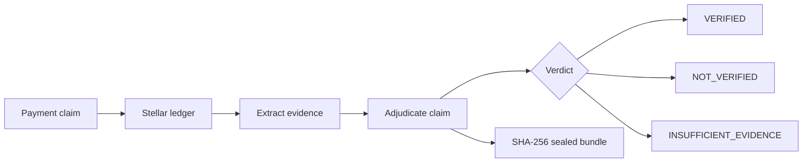

# PROOF

<p align="center">
  
</p>

**English** | [Español](README_ES.md) | [Technical README](TECHNICAL.md) | [Install](INSTALL.md) | [Product Validation](docs/PRODUCT_VALIDATION.md)

## The problem

Someone sends you a screenshot saying they paid. You look at it. It looks
real. But you cannot tell — a screenshot is an image, not evidence. It can
be edited, fabricated, or taken from a different transaction entirely.

The question is not "does this screenshot look real?" The question is:
**did this payment actually happen on the Stellar ledger?**

## What PROOF does

PROOF takes a Stellar transaction hash and a payment claim, reconstructs
the facts from the ledger, and produces a sealed evidence bundle with a
verdict.

```
"Alice paid Bob 100 USDC for invoice INV-184"
                    |
                    v
           Stellar ledger (transaction hash)
                    |
                    v
          Deterministic evidence extraction
                    |
                    v
          Claim vs evidence adjudication
                    |
                    v
          VERIFIED / NOT VERIFIED / INSUFFICIENT EVIDENCE
                    |
                    v
          Sealed evidence bundle (SHA-256)
```

PROOF does not look at screenshots. It looks at the ledger.



## Observable behavior

**Claim: "100 USDC from Alice to Bob for INV-184"**

```
EVIDENCE
  transaction exists          PASS
  transaction successful     PASS
  sender matches              PASS
  recipient matches           PASS
  asset matches               PASS
  amount = 100 USDC           PASS
  reference = INV-184         PASS

VERDICT: VERIFIED
Seal: sha256:...
```

**Claim: "100 USDC to Bob" (but the transaction went elsewhere)**

```
EVIDENCE
  transaction exists          PASS
  transaction successful      PASS
  amount = 100 USDC           PASS
  recipient matches           FAIL  (expected Bob, got someone else)

VERDICT: NOT VERIFIED
```

**Claim: "100 USDC paid, goods delivered"**

```
EVIDENCE
  transaction exists          PASS
  transaction successful      PASS
  amount = 100 USDC           PASS

VERDICT: VERIFIED
DELIVERY: OUTSIDE EVIDENCE SCOPE
```

PROOF verifies what the ledger can prove. It does not claim more.

## What PROOF does not prove

These are not limitations to hide — they are boundaries that make the
verdict trustworthy:

- **Payment executed is not debt satisfied.** A successful transaction
  proves the asset moved. It does not prove the underlying obligation is
  legally fulfilled.
- **Transaction exists is not goods delivered.** The ledger records
  financial events, not physical ones.
- **Wallet signed is not human identity.** A signature proves a key was
  used, not who was behind the keyboard.

## How it works

1. **Input:** a `PaymentClaim` (transaction hash + optional assertions:
   sender, recipient, asset, amount, reference, ledger window) and a
   network (testnet or mainnet).
2. **Fetch:** PROOF queries the Stellar Horizon API for the transaction
   and its operations.
3. **Extract:** payment-relevant facts are reconstructed: sender,
   recipient, asset, amount (in integer stroops), timestamp, success
   status, memo.
4. **Adjudicate:** each claim proposition is checked independently
   against the evidence. Unspecified fields are ABSTAIN, not assumed true.
5. **Seal:** the claim, evidence, checks, and verdict are canonicalized
   (typed, ordered, versioned) and sealed with SHA-256.
6. **Verify:** an independent stdlib-only verifier can recompute the seal
   and confirm the bundle was not tampered.

## Repository

```
proof/
  canonicalize.py    # typed, ordered, versioned serialization + SHA-256 seal
  claim.py           # PaymentClaim — what someone asserts happened
  evidence.py        # PaymentEvidence, CheckResult, EvidenceBundle
  stellar_client.py  # Horizon API wrapper (testnet + mainnet)
  extractor.py       # reconstruct evidence from tx + operations
  adjudicator.py     # compare claim vs evidence, produce checks + verdict
  verifier.py        # independent stdlib-only bundle verifier
  engine.py          # main entry point: verify_payment(claim, network)
  api.py             # FastAPI HTTP API + user-facing UI at GET /
  mcp_server.py      # MCP server for LLM integration
  soroban/proof-registry/  # Soroban registry contract (Rust, optional to build locally)
scripts/
  testnet_e2e.py     # real end-to-end test against Stellar Testnet
tests/               # 161 tests: canonicalization, adjudication, determinism, boundary, extractor, commitment, dispute, api, mcp, stellar_client, adversarial
```

## Live Testnet proof

PROOF has been validated end-to-end against the Stellar Testnet:

- **Payment transaction:** `0ef76485729ca2704ea73ff3fc65f7d156c286bacc52bd8d36d19deace4de669`
- **Payment ledger:** `4821215`
- **PROOF verdict:** `VERIFIED`
- **Evidence seal:** `c6d21734805d59886bc9a629893eb108a0666c74a03ed6e19e5abdc50e1b7d51`
- **Soroban registry:** `CDY3VWVDMRNMPGENYV4BCVNVVGLUWF76TQTSOJOOBOPG4XXLTEH7NT4I`
- **Commitment ledger:** `4821217`
- **Receipt ledger:** `4821218`

The resulting evidence bundle was independently verified, tampering was
detected after mutation, and the on-chain commitment and receipt were retrieved
from the deployed Soroban contract.

## Try it

### Option 1: Public API (read-only)

The API is deployed on Google Cloud Run:

```
https://proof-api-1028999311218.us-central1.run.app
```

Public read-only operations (no credentials required):

| Endpoint | Method | Description |
|---|---|---|
| `/` | GET | User-facing verification UI |
| `/health` | GET | Health check |
| `/verify` | POST | Verify a payment claim against the ledger |
| `/verify/dispute` | POST | Verify a dispute between two claims |
| `/onchain/commitment` | GET | Retrieve a commitment from the Soroban contract |
| `/onchain/receipt` | GET | Retrieve a receipt from the Soroban contract |

Write operations require a funded Soroban identity and are **not enabled** on
the public deployment:

| Endpoint | Method | Requires |
|---|---|---|
| `/commit` | POST | Funded Stellar identity (Secret Manager) |
| `/onchain/register-receipt` | POST | Funded Stellar identity (Secret Manager) |
| `/receipt` | POST | Local execution only |

The public deployment uses an unfunded identity so writes fail naturally
without leaking protocol semantics. This preserves the frozen authorization
model — no shortcuts for the demo.

### Option 2: Local Web UI

For full installation instructions, see [INSTALL.md](INSTALL.md).

```bash
cd proof
source .venv/bin/activate
uvicorn proof.api:app --host 0.0.0.0 --port 8000
```

Open `http://localhost:8000` in your browser. Enter a Stellar transaction
hash and optional claim fields, then click "Verify Payment".

### Option 3: Command line

```bash
cd proof
source .venv/bin/activate

python -c "
from proof import PaymentClaim, verify_payment

claim = PaymentClaim(
    transaction_hash='your_tx_hash_here',
)
bundle = verify_payment(claim, network='testnet')
print(bundle.verdict)
print(bundle.seal)
"
```

### Option 4: Real end-to-end against Testnet

```bash
python scripts/testnet_e2e.py
```

This script generates real keypairs, funds an account via Friendbot,
submits a real payment to Testnet, and verifies it with PROOF end-to-end.

## Tests

```bash
source .venv/bin/activate
python -m pytest tests/ -v
```

161 tests covering: canonical serialization, claim validation, adjudication
logic, tamper detection, determinism, multi-operation extraction, path
payments, account merge, memo type classification, commitment hashing,
commitment adjudication, receipt issuance, dispute resolution, API/MCP
boundary validation, Stellar client error handling, and adversarial
verification against real Testnet transactions.

For the full architecture, threat model, and design decisions, see the
[Technical README](TECHNICAL.md).

## Screenshots


