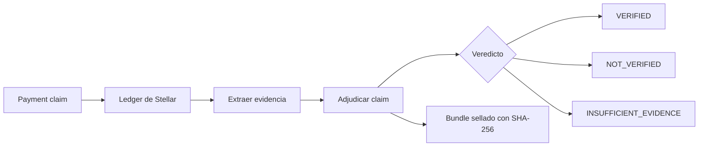

# PROOF

<p align="center">
  
</p>

[Español](README_ES.md) | **English** | [Technical README](TECHNICAL.md) | [Instalación](INSTALL.md) | [Validación de Producto](docs/PRODUCT_VALIDATION.md)

## El problema

Alguien te manda una captura diciendo que te pagó. La mirás. Parece real.
Pero no podés saberlo — una captura es una imagen, no evidencia. Se puede
editar, fabricar, o sacar de una transacción distinta.

La pregunta no es "¿esta captura parece real?" La pregunta es:
**¿este pago realmente ocurrió en el ledger de Stellar?**

## Qué hace PROOF

PROOF recibe un hash de transacción de Stellar y un payment claim,
reconstruye los hechos desde el ledger, y produce un evidence bundle sellado
con un veredicto.

```
"Alice le pagó a Bob 100 USDC por la factura INV-184"
                    |
                    v
           Stellar ledger (hash de transacción)
                    |
                    v
          Extracción determinista de evidencia
                    |
                    v
          Adjudicación: claim vs evidencia
                    |
                    v
          VERIFIED / NOT VERIFIED / INSUFFICIENT EVIDENCE
                    |
                    v
          Evidence bundle sellado (SHA-256)
```

PROOF no mira capturas. Mira el ledger.



## Comportamiento observable

**Claim: "100 USDC de Alice a Bob por INV-184"**

```
EVIDENCE
  transacción existe          PASS
  transacción exitosa         PASS
  emisor coincide              PASS
  receptor coincide            PASS
  asset coincide               PASS
  monto = 100 USDC             PASS
  referencia = INV-184         PASS

VEREDICTO: VERIFIED
Seal: sha256:...
```

**Claim: "100 USDC a Bob" (pero la transacción fue a otro lado)**

```
EVIDENCE
  transacción existe          PASS
  transacción exitosa         PASS
  monto = 100 USDC             PASS
  receptor coincide            FAIL  (esperado Bob, recibido otro)

VEREDICTO: NOT VERIFIED
```

**Claim: "100 USDC pagados, mercadería entregada"**

```
EVIDENCE
  transacción existe          PASS
  transacción exitosa         PASS
  monto = 100 USDC             PASS

VEREDICTO: VERIFIED
ENTREGA: FUERA DEL ALCANCE DE LA EVIDENCIA
```

PROOF verifica lo que el ledger puede probar. No afirma más que eso.

## Lo que PROOF no prueba

Estas no son limitaciones para esconder — son los límites que hacen que el
veredicto sea confiable:

- **Pago ejecutado no es deuda saldada.** Una transacción exitosa prueba
  que el activo se movió. No prueba que la obligación subyacente esté
  legalmente cumplida.
- **Transacción existe no es mercadería entregada.** El ledger registra
  eventos financieros, no físicos.
- **Wallet firmó no es identidad humana.** Una firma prueba que se usó
  una clave, no quién estaba detrás del teclado.

## Cómo funciona

1. **Entrada:** un `PaymentClaim` (hash de transacción + aserciones
   opcionales: emisor, receptor, asset, monto, referencia, ventana de
   ledger) y una red (testnet o mainnet).
2. **Fetch:** PROOF consulta la API de Stellar Horizon por la transacción
   y sus operaciones.
3. **Extracción:** se reconstruyen los hechos relevantes del pago: emisor,
   receptor, asset, monto (en stroops enteros), timestamp, estado de
   éxito, memo.
4. **Adjudicación:** cada proposición del claim se chequea
   independientemente contra la evidencia. Campos no especificados son
   ABSTAIN, no asumidos verdaderos.
5. **Sellado:** el claim, la evidencia, los checks y el veredicto se
   canonicalizan (tipados, ordenados, versionados) y se sellan con SHA-256.
6. **Verificación:** un verificador independiente (solo stdlib) puede
   recalcular el seal y confirmar que el bundle no fue alterado.

## Repositorio

```
proof/
  canonicalize.py    # serialización tipada, ordenada, versionada + seal SHA-256
  claim.py           # PaymentClaim — lo que alguien afirma que ocurrió
  evidence.py        # PaymentEvidence, CheckResult, EvidenceBundle
  stellar_client.py  # wrapper de la API de Horizon (testnet + mainnet)
  extractor.py       # reconstruir evidencia desde tx + operaciones
  adjudicator.py     # comparar claim vs evidencia, producir checks + veredicto
  verifier.py        # verificador independiente de bundles (solo stdlib)
  engine.py          # entry point: verify_payment(claim, network)
  api.py             # FastAPI HTTP API + UI en GET /
  mcp_server.py      # MCP server para integración con LLMs
  soroban/proof-registry/  # contrato registry Soroban (Rust, opcional de compilar localmente)
scripts/
  testnet_e2e.py     # test end-to-end real contra Stellar Testnet
tests/               # 161 tests: canonicalización, adjudicación, determinismo, boundary, extractor, commitment, dispute, api, mcp, stellar_client, adversariales
```

## Evidencia en Testnet

PROOF fue validado end-to-end contra Stellar Testnet:

- **Transacción de pago:** `0ef76485729ca2704ea73ff3fc65f7d156c286bacc52bd8d36d19deace4de669`
- **Ledger de pago:** `4821215`
- **Veredicto PROOF:** `VERIFIED`
- **Seal de evidencia:** `c6d21734805d59886bc9a629893eb108a0666c74a03ed6e19e5abdc50e1b7d51`
- **Registro Soroban:** `CDY3VWVDMRNMPGENYV4BCVNVVGLUWF76TQTSOJOOBOPG4XXLTEH7NT4I`
- **Ledger de commitment:** `4821217`
- **Ledger de receipt:** `4821218`

El bundle de evidencia resultante fue verificado independientemente, el
tampering fue detectado tras la mutación, y el commitment y receipt on-chain
fueron recuperados del contrato Soroban desplegado.

## Probalo

### Opción 1: API pública (read-only)

La API está desplegada en Google Cloud Run:

```
https://proof-api-1028999311218.us-central1.run.app
```

Operaciones públicas read-only (sin credenciales):

| Endpoint | Method | Descripción |
|---|---|---|
| `/` | GET | UI de verificación |
| `/health` | GET | Health check |
| `/verify` | POST | Verificar un claim de pago contra el ledger |
| `/verify/dispute` | POST | Verificar una disputa entre dos claims |
| `/onchain/commitment` | GET | Recuperar un commitment del contrato Soroban |
| `/onchain/receipt` | GET | Recuperar un receipt del contrato Soroban |

Operaciones de escritura requieren una identidad Soroban fondeada y **no
están habilitadas** en el deployment público:

| Endpoint | Method | Requiere |
|---|---|---|
| `/commit` | POST | Identidad Stellar fondeada (Secret Manager) |
| `/onchain/register-receipt` | POST | Identidad Stellar fondeada (Secret Manager) |
| `/receipt` | POST | Solo ejecución local |

El deployment público usa una identidad sin fondos para que los writes
fallen naturalmente sin filtrar semántica del protocolo. Esto preserva el
modelo de autorización congelado — sin atajos para la demo.

### Opción 2: Web UI local

Para instrucciones de instalación completas, ver [INSTALL.md](INSTALL.md).

```bash
cd proof
source .venv/bin/activate
uvicorn proof.api:app --host 0.0.0.0 --port 8000
```

Abrí `http://localhost:8000` en el navegador. Ingresá un hash de
transacción de Stellar y los campos opcionales del claim, y hacé clic
en "Verify Payment".

### Opción 3: Línea de comandos

```bash
cd proof
source .venv/bin/activate

python -c "
from proof import PaymentClaim, verify_payment

claim = PaymentClaim(
    transaction_hash='tu_hash_aqui',
)
bundle = verify_payment(claim, network='testnet')
print(bundle.verdict)
print(bundle.seal)
"
```

### Opción 4: End-to-end real contra Testnet

```bash
python scripts/testnet_e2e.py
```

Este script genera keypairs reales, fondea una cuenta via Friendbot,
envía un pago real a Testnet, y lo verifica con PROOF end-to-end.

## Tests

```bash
source .venv/bin/activate
python -m pytest tests/ -v
```

161 tests cubriendo: serialización canónica, validación de claims,
lógica de adjudicación, detección de alteraciones, determinismo,
extracción multi-operación, path payments, account merge,
clasificación de memo types, hashing de commitments, adjudicación de
commitments, emisión de receipts, resolución de disputas, validación
de boundary de API/MCP, manejo de errores del cliente Stellar, y
verificación adversarial contra transacciones reales de Testnet.

Para la arquitectura completa, modelo de amenazas, y decisiones de diseño,
ver el [Technical README](TECHNICAL.md).

## Screenshots


