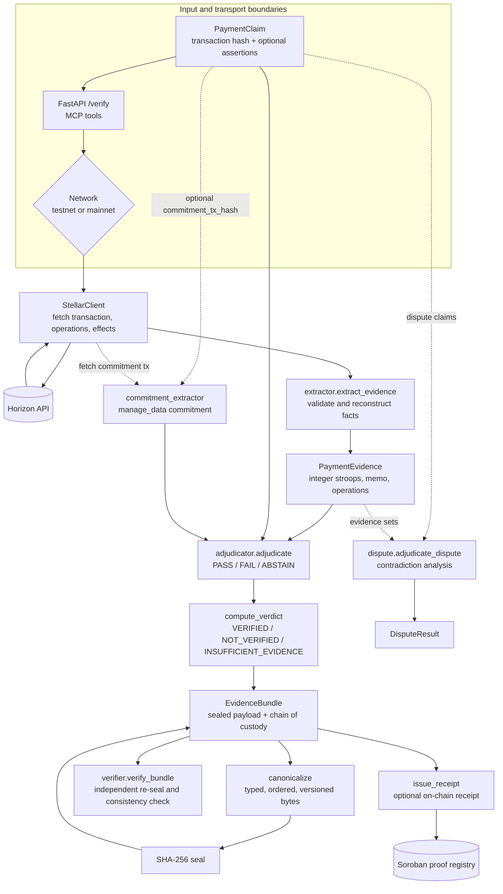

# PROOF — Technical README

<p align="center">
  
</p>

Architecture, threat model, design decisions, and invariants.

## Architecture



The technical flow is intentionally fail-closed: any fetch or extraction
error terminates in `INSUFFICIENT_EVIDENCE`; only a complete set of passing
applicable checks can produce `VERIFIED`.

For an explorable rendered version of this architecture, see
[`docs/proof-architecture.html`](docs/proof-architecture.html). Its source
specification and visual-check receipt are kept beside the artifact.

## Data model

### PaymentClaim

What someone asserts happened. Every field is optional except
`transaction_hash`. Fields left as `None` are not checked (ABSTAIN).

| Field | Type | Description |
|---|---|---|
| `transaction_hash` | `str` | 64-char hex hash (required) |
| `sender` | `str \| None` | Stellar address (G...) |
| `recipient` | `str \| None` | Stellar address (G...) |
| `asset_code` | `str \| None` | e.g., "XLM", "USDC" |
| `asset_issuer` | `str \| None` | Issuer address (G...) |
| `amount_stroops` | `int \| None` | Amount in stroops (integer) |
| `reference` | `str \| None` | Memo/reference text |
| `ledger_min` | `int \| None` | Earliest acceptable ledger |
| `ledger_max` | `int \| None` | Latest acceptable ledger |

### PaymentEvidence

What the ledger shows. All fields are populated from the Horizon API
response, validated at the boundary.

| Field | Type | Description |
|---|---|---|
| `transaction_hash` | `str` | 64-char hex hash |
| `ledger` | `int` | Ledger sequence number |
| `timestamp_unix` | `int` | Unix timestamp (seconds) |
| `successful` | `bool` | Whether the tx succeeded |
| `sender` | `str` | Source address |
| `recipient` | `str` | Destination address |
| `asset_code` | `str` | "XLM" or custom code |
| `asset_issuer` | `str \| None` | None for native XLM |
| `amount_stroops` | `int` | Amount in stroops |
| `memo` | `str \| None` | Transaction memo |
| `operation_type` | `str` | "payment", "create_account", etc. |

### EvidenceBundle

The sealed output. The `sealed_payload` (version, claim, evidence, checks,
verdict, scope_notes) is what gets hashed. The `chain_of_custody` is
metadata stored beside the seal, not inside it.

See the [annotated EvidenceBundle example](docs/evidence-bundle-example.md)
for a compact bundle with the seal boundary called out explicitly.

## Canonical serialization

The canonicalizer (`canonicalize.py`) is the single source of truth for
deterministic serialization. Properties:

- **Typed:** `bool` is checked before `int` (bool subclasses int in Python).
  `True` becomes `"true"`, `1` becomes `"1:int"`, `"1"` stays `"1"`. These
  never collide.
- **Ordered:** dict keys are sorted recursively. Dict insertion order
  never leaks into the bytes.
- **Versioned:** `CANONICALIZE_VERSION = "1"` is stamped into every sealed
  payload. When the schema changes, the version is bumped and old verifiers
  keep working.

The seal is `SHA-256(canonical_bytes(payload))` where `canonical_bytes`
produces `json.dumps(canonicalize(payload), sort_keys=True, ensure_ascii=False)`.

## Determinism guarantees

- No float in any sealed value. Amounts are integer stroops.
- No timestamp inside the sealed payload. `fetched_at` is in
  `chain_of_custody`, outside the seal.
- No dict ordering dependence. Keys are sorted recursively.
- No set iteration. No `PYTHONHASHSEED` dependence.
- The same claim + evidence always produces the same seal. Verified by
  `test_determinism.py` (5 runs, identical seals).

## Threat model

**Attacker CAN:**
- Submit any string as a transaction hash.
- Submit any claim with any values (valid format, arbitrary content).
- Choose the network (testnet or mainnet).

**Attacker CANNOT:**
- Modify the Stellar ledger.
- Forge a transaction hash (SHA-256 preimage resistance).
- Alter Horizon API responses in transit (TLS).
- Control the PROOF execution environment.

**Trust boundaries:**
1. **Input boundary** — `PaymentClaim.__post_init__` validates every field.
   Invalid hashes, addresses, amounts, and ledger ranges are rejected
   before any processing.
2. **Horizon API boundary** — external data source. Responses are trusted
   only as much as the TLS connection to Horizon. The extractor validates
   every field from the response.
3. **Sealing boundary** — the canonical serialization and SHA-256 seal are
   the integrity guarantee. The verifier recomputes the seal independently.

## Security properties

- **Fail closed:** any error (tx not found, extraction failure, network
  error) returns `INSUFFICIENT_EVIDENCE`, never `VERIFIED`.
- **No ambient authority:** the Stellar client receives the network
  parameter explicitly; no global state.
- **Bound everything:** stroops are bounded by `MAX_STROOPS` (2^63 - 1).
  Ledger sequences are non-negative. Addresses are format-validated.
- **Idempotent:** the same claim + network always produces the same verdict
  and seal (given the same ledger state).

## Design decisions

### Why integer stroops, not decimal amounts?

Stellar amounts are signed 64-bit integers in stroops. Horizon returns them
as decimal strings ("100.0000000"). Converting to `int` via `Decimal`
(exact arithmetic) preserves the integer nature. Float would introduce
ordering- and platform-dependent rounding — a determinism defect.

### Why ABSTAIN instead of "match anything" for unspecified fields?

A claim that doesn't specify a recipient should not be treated as "any
recipient is fine." ABSTAIN makes this explicit: "this proposition was not
asserted, so it was not checked." The scope notes remind the user what
PROOF does not prove.

### Why three verdicts, not two?

`INSUFFICIENT_EVIDENCE` (could not look) is semantically distinct from
`NOT_VERIFIED` (looked and the claim does not hold). Collapsing them
would hide the difference between "the transaction doesn't exist" and
"the transaction exists but doesn't match the claim."

### Why is chain_of_custody outside the seal?

The `fetched_at` timestamp changes every time you query Horizon. If it
were inside the seal, re-verifying a bundle would fail because the
timestamp differs. The seal covers the facts (claim, evidence, checks,
verdict); the metadata (when it was fetched, from where, with what tool
version) lives beside it.

### Why an independent verifier?

A verifier that imports the producer's logic can inherit the producer's
bug. `verifier.py` uses only `hashlib`, `json`, and `canonicalize` — it
does not import the engine, the extractor, or the adjudicator. It
recomputes the seal from the bundle's fields and checks consistency.

## Supported operation types

| Type | L3 support | Notes |
|---|---|---|
| `payment` | Full | Single-asset transfer |
| `create_account` | Full | XLM, amount from starting_balance |
| `path_payment_strict_receive` | Full | Source + destination assets, both amounts |
| `path_payment_strict_send` | Full | Source + destination assets, both amounts |
| `account_merge` | Full | Amount from effects (account_debited) |

## Multi-operation transactions

L3 extracts ALL payment-type operations from a transaction, not just the
first. Each operation is represented as a `PaymentOperation` in the
`operations` list. The top-level fields (`sender`, `recipient`, `asset_code`,
etc.) are convenience aliases for the first operation, preserving backward
compatibility with L1/L2 callers.

## Memo types

L3 classifies memos into four types: `text`, `hash`, `return`, `none`.
Reference matching only compares the claim's `reference` against the memo
when `memo_type` is `text`. Hash and return memos are binary and don't have
a string representation that a claim's reference field would match
meaningfully — those produce ABSTAIN.

## Known limitations (L3)

- **Source asset claims:** the `PaymentClaim` does not yet have a
  `source_asset_code` field. Path payment source assets are extracted and
  reported in the evidence, but the adjudicator ABSTAINs on source asset
  matching. Adding source asset assertions to claims is a future
  enhancement.

## Milestone history (L3)

The following were L3 limitations that have since been resolved by
later levels. They are recorded here as architectural history, not as
current limitations:

- **On-chain receipts** (resolved by L4): L3 had no on-chain receipt
  registration. L4 added Soroban-based commitment and receipt registration.
- **No API/MCP server** (resolved by L6): L3 had no external interface.
  L6 exposed the deterministic core via HTTP API and MCP server.

## L4: Commitments and receipts on-chain

L4 adds the ability to register payment commitments on-chain and verify
payments against them. A commitment is a pre-registered expectation of a
payment, stored as a hash in a `manage_data` operation.

### Commitment flow

1. Before the payment, the committer creates `CommitmentTerms` with the
   expected payment fields (sender, recipient, asset, amount, reference).
2. The committer computes `commitment_hash = SHA-256(canonical(terms))`.
3. The committer submits a transaction with a `manage_data` operation:
   - key: `PROOF:COMMIT:<reference>` (e.g., `PROOF:COMMIT:INV-184`)
   - value: base64-encoded commitment hash
4. When the payment later occurs, PROOF:
   - fetches the payment evidence (L1-L3)
   - fetches the commitment transaction (via `commitment_tx_hash` in the claim)
   - extracts the commitment from the `manage_data` operation
   - reconstructs the commitment terms from the actual payment evidence
   - recomputes the hash and compares with the committed hash
   - checks that the commitment was registered before the payment (temporal order)

### Commitment checks

| Check | Description |
|---|---|
| `commitment_exists` | Was a commitment found for the given tx hash? |
| `commitment_precedes_payment` | Was the commitment registered before the payment? |
| `commitment_hash_matches` | Does the payment evidence match the committed hash? |

If no `commitment_tx_hash` is provided in the claim, all commitment checks
are ABSTAIN — the payment is verified without commitment context.

### Receipts

After verifying a payment, PROOF can issue a `Receipt` — the seal of the
evidence bundle, registrable on-chain via `manage_data`:
- key: `PROOF:RECEIPT:<transaction_hash>`
- value: the bundle seal

This creates an on-chain record that PROOF verified the payment at a
specific time. The receipt is outside the seal (it contains the seal, not
the other way around).

### On-chain storage: Soroban (primary) vs manage_data (fallback)

PROOF supports two on-chain commitment mechanisms. The commitment hash
computation (`CommitmentTerms.commitment_hash()`) is identical for both —
the difference is only in the transport.

**Soroban contract (PRIMARY):** the `proof-registry` contract is deployed
on Stellar Testnet. It provides:
- `require_auth()` — the committer must authorize the registration.
- Enforced immutability — a commitment or receipt cannot be overwritten
  (the contract panics on duplicate references/tx hashes).
- On-chain temporal order verification — `verify_temporal_order` checks
  that a commitment was registered at an earlier ledger than a receipt.
- Queryable storage via Soroban RPC.

Contract ID (Testnet): `CDY3VWVDMRNMPGENYV4BCVNVVGLUWF76TQTSOJOOBOPG4XXLTEH7NT4I`

**manage_data (FALLBACK):** native Stellar `manage_data` operations store
the commitment hash as a key-value pair. This works on all Stellar
accounts without Soroban, but lacks auth enforcement, immutability, and
temporal order verification. It is retained for environments where
Soroban is not available.

The API and MCP server use the Soroban contract as the primary
mechanism. The manage_data path remains in the Python core for backward
compatibility but is not exposed through the API.

## Known limitations (L4)

- **Commitment terms not on-chain:** only the commitment hash is stored
  on-chain. The terms (sender, recipient, etc.) are known to the committer
  but not to PROOF. PROOF reconstructs them from the payment evidence and
  checks the hash. This means PROOF can verify that the payment matches the
  commitment, but cannot independently recover the commitment terms.
- **Contract stores pre-computed hashes:** the Soroban contract does not
  canonicalize or verify the commitment terms. It trusts the off-chain
  core to compute the hash correctly. This is by design — the contract is
  a registry, not a verifier.

## L5: Disputes and contradictory states

L5 adds the ability to adjudicate disputes between two contradictory
payment claims. Each claim is verified independently against the ledger,
then the evidence sets are compared for contradictions.

### Dispute scenarios

1. **Same transaction, different claims:** Alice says "I paid Bob 100 USDC
   for INV-184." Bob says "I received 50 USDC from Alice." Both reference
   the same transaction. PROOF verifies each claim and checks that the
   evidence sets are consistent (they should be, since they come from the
   same ledger data).

2. **Different transactions, same reference:** Alice says "tx A pays for
   INV-184." Bob says "tx B pays for INV-184." Both can't be right — only
   one payment can satisfy an invoice. PROOF detects the reference
   collision across different transactions.

3. **One claim verified, one not:** Alice's claim verifies against the
   ledger, Bob's doesn't. PROOF reports CLAIM_A_VERIFIED.

4. **Contradictory evidence:** Two evidence sets that should be identical
   (same transaction) differ in fields. This indicates tampering or
   reconstruction error. PROOF reports CONTRADICTION.

### Dispute verdicts

| Verdict | Meaning |
|---|---|
| `CLAIM_A_VERIFIED` | Claim A is verified, claim B is not |
| `CLAIM_B_VERIFIED` | Claim B is verified, claim A is not |
| `BOTH_VERIFIED` | Both claims are verified (not contradictory) |
| `NEITHER_VERIFIED` | Neither claim is verified |
| `CONTRADICTION` | Evidence sets contain contradictions |

Contradiction dominates: if contradictions are found, the dispute verdict
is CONTRADICTION regardless of individual claim verdicts.

### What L5 does not do

- PROOF does not determine who is "telling the truth" in a human sense.
- PROOF does not adjudicate legal disputes or contractual obligations.
- PROOF only reports what the ledger can establish about each claim and
  whether the evidence sets are mutually consistent.

## Known limitations (L5)

- **No on-chain dispute resolution:** L5 is off-chain analysis only. A
  future Soroban contract could store dispute results on-chain.

## Milestone history (L5)

The following was an L5 limitation that has since been resolved by a
later level. It is recorded here as architectural history, not as a
current limitation:

- **No API/MCP server** (resolved by L6): L5 had no external interface.
  L6 exposed the deterministic core via HTTP API and MCP server.

## L6: HTTP API and MCP server

L6 exposes the deterministic core via two interfaces so third parties can
verify payment claims without running the full pipeline locally.

### HTTP API (FastAPI)

| Endpoint | Method | Description |
|---|---|---|
| `/` | GET | User-facing verification UI (HTML) |
| `/health` | GET | Health check |
| `/verify` | POST | Verify a single payment claim |
| `/verify/dispute` | POST | Verify a dispute between two claims |
| `/receipt` | POST | Issue a receipt from a verified bundle |
| `/commit` | POST | Register a commitment on the Soroban contract |
| `/onchain/commitment` | GET | Retrieve a commitment from the Soroban contract |
| `/onchain/receipt` | GET | Retrieve a receipt from the Soroban contract |
| `/onchain/register-receipt` | POST | Register a receipt on the Soroban contract |

The API is a thin transport layer. All logic lives in the deterministic
core. The API never modifies verdicts, seals, or evidence. Input
validation happens at the boundary (Pydantic models + PaymentClaim
validation) before reaching the engine.

The UI accessibility/state audit is recorded in
[`docs/ui-accessibility-audit.md`](docs/ui-accessibility-audit.md); it
separates automated evidence from browser checks that remain manual.

Run the API:
```bash
uvicorn proof.api:app --reload
```

### MCP server (stdio)

The MCP server exposes eight tools for AI agents:

| Tool | Description |
|---|---|
| `verify_payment` | Verify a single payment claim |
| `verify_dispute` | Verify a dispute between two claims |
| `issue_receipt` | Issue a receipt from a verified bundle |
| `compute_commitment_hash` | Compute a commitment hash from payment terms |
| `register_commitment` | Register a commitment on the Soroban contract |
| `get_onchain_commitment` | Retrieve a commitment from the Soroban contract |
| `register_onchain_receipt` | Register a receipt on the Soroban contract |
| `get_onchain_receipt` | Retrieve a receipt from the Soroban contract |

The MCP server is a thin transport layer. It never modifies verdicts,
seals, or evidence. All logic lives in the deterministic core.

Run the MCP server:
```bash
python -m proof.mcp_server
```

### What L6 does not do

- The API does not authenticate callers. Authentication is a deployment
  concern, not a verification concern.
- The API does not cache results. Each call fetches fresh ledger data.
- The MCP server does not expose the verifier. Verification of a bundle
  is a local operation (the verifier is stdlib-only).

## Known limitations (L6)

- **No authentication:** the API is open. Deploy behind a gateway with
  auth/rate-limiting for production.
- **No caching:** each API call fetches fresh ledger data.
- **No streaming:** results are returned as a single JSON response.
- **No TLS certificate pinning:** the Stellar SDK uses system CAs.
  PROOF is only as trustworthy as its Horizon connection. For high-assurance
  deployments, consider: (1) pinning the Horizon server's certificate,
  (2) fetching from multiple Horizon instances and comparing results,
  (3) running a local Horizon node. See the red team review
  (`docs/red-team-review.md`, Finding 3) for details.

## Public deployment

The API is deployed on Google Cloud Run:

```
https://proof-api-1028999311218.us-central1.run.app
```

### Read-only operations (public)

| Endpoint | Method | Description |
|---|---|---|
| `/` | GET | User-facing verification UI |
| `/health` | GET | Health check |
| `/verify` | POST | Verify a payment claim against the ledger |
| `/verify/dispute` | POST | Verify a dispute between two claims |
| `/onchain/commitment` | GET | Retrieve a commitment from the Soroban contract |
| `/onchain/receipt` | GET | Retrieve a receipt from the Soroban contract |

### Write operations (require funded identity — not enabled publicly)

| Endpoint | Method | Requires |
|---|---|---|
| `/commit` | POST | Funded Stellar identity (Secret Manager) |
| `/onchain/register-receipt` | POST | Funded Stellar identity (Secret Manager) |
| `/receipt` | POST | Local execution only |

The public deployment uses an unfunded Stellar identity stored in Google
Secret Manager. Read-only operations work because Soroban simulation does
not require a funded account. Write operations fail naturally with "Account
not found" because the identity has no XLM. This preserves the frozen
authorization model — no public writes, no shortcuts for the demo.

### Known deployment blockers (unresolved)

These blockers are documented as open limitations, not as resolved
properties:

- **Public writes disabled:** the public deployment cannot register
  commitments or receipts on-chain. Enabling writes requires a funded
  identity in Secret Manager and is a post-freeze decision.
- **No rate limiting:** the public API has no rate limiting. A determined
  caller could exhaust the Testnet Horizon quota.
- **No TLS pinning to Horizon:** Cloud Run terminates TLS for the client,
  but the server-to-Horizon connection uses system CAs (Finding 3).
- **Cold starts:** Cloud Run may add 1-2s latency on the first request
  after idle. Subsequent requests are fast.
- **Testnet pruning:** Testnet transactions may be pruned. The demo
  references a specific tx that may eventually become unavailable.

## Falsifiers

- **Determinism claim:** if two runs of the same claim + evidence produce
  different seals, the determinism invariant is violated. Test:
  `test_determinism.py::test_seal_is_deterministic_across_runs`.
- **Tamper detection:** if modifying any sealed field does not break the
  seal, the integrity guarantee is violated. Tests:
  `test_verifier.py::test_tampered_*`.
- **Fail closed:** if any error path returns VERIFIED, the security
  invariant is violated. Test: `test_adjudicator.py::test_failed_*`.

## Protocol freeze

The PROOF protocol, Soroban contract, and public deployment are frozen
as of this commit. No changes to the contract interface, the commitment
hash computation, the evidence bundle schema, the verdict semantics, or
the public API surface will be made before the hackathon deadline. Bug
fixes, tests, UI/demo polish, documentation, and product validation are
allowed; new product capabilities are not.

Frozen components:
- Soroban contract: `proof-registry` v0.1.0 (Testnet ID above)
- Commitment hash: `SHA-256(canonical(CommitmentTerms))` — version 1
- Evidence bundle schema: version 1 (claim, evidence, checks, verdict,
  scope_notes, seal, chain_of_custody, optional commitment)
- Verdicts: VERIFIED, NOT_VERIFIED, INSUFFICIENT_EVIDENCE
- Check statuses: PASS, FAIL, ABSTAIN
- Public API: 6 read-only endpoints, 3 write endpoints (writes disabled
  on public deployment)
- MCP tools: 8 tools (4 verification, 4 Soroban)
- Test suite: 161 tests, 0 skipped

## Screenshots


